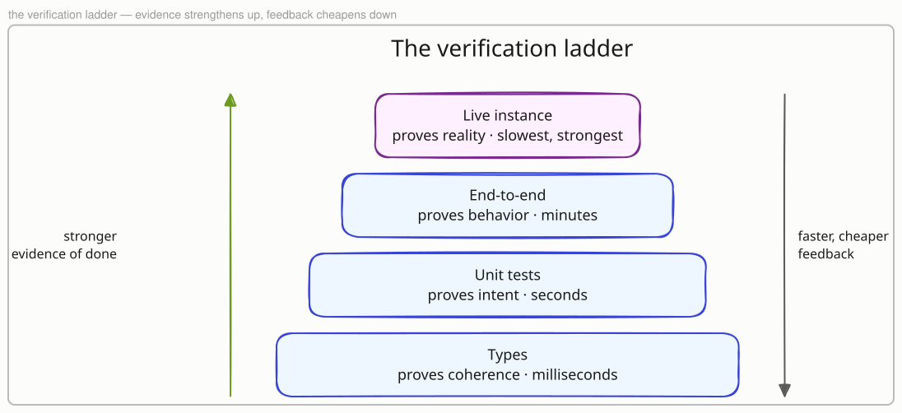

# Validation

[Chapter 5](05-implementation.md) ended with a ticket built — tests green, diff surgical — and one thing missing: proof in the project's own Verification Medium. [Chapter 1](01-why-this-works.md) named that concept: the evidence that proves a change is done, checked by the agent itself instead of a human watching. This Chapter is about building it — choosing the strongest evidence your project can hand an agent, making its verdicts machine-readable, and sharpening it until you can trust a green result you never watched happen. The Verification Medium is the core autonomy lever: an agent that can check its own work loops until done; an agent that cannot, stops after every change and waits for you.

## Evidence climbs a ladder

Not all green means the same thing. A type check proves the code is coherent; a unit test proves one unit does what its author intended; an end-to-end run proves the assembled system behaves; a live instance proves the change survives contact with the real thing. Each rung up is stronger evidence of done — and slower, costlier, and harder to automate. The rungs stack rather than replace each other: a live-instance check that fails on a typo wastes its cost on what a type check would have caught in milliseconds.

The principle: **your Verification Medium is the highest rung the agent can climb alone.** The lower rungs come nearly free with any modern toolchain; the top rungs are a deliberate investment — an environment to run against, a harness to drive it, a way to read the result mechanically. Every project has its own ceiling, and the medium is project-specific because the truth is: a CLI's truth fits in assertions, a report's truth is partly a picture, a docs site's truth is a built page. Deciding the rung is a planning act — [Chapter 4](04-from-idea-to-plan.md) names the medium while shaping the spec, not after the build.

!!! example "crm — the top rung is a live Dynamics instance"
    `crm`, a command-line client for Microsoft Dynamics 365, climbs the whole
    ladder: types and unit tests come free with the toolchain, and above them
    an end-to-end suite drives the built CLI against a live sandbox instance.
    A passing run means the command worked against the real API — real
    authentication, real metadata, real paging — not against a mock's idea of
    it. That top rung is what lets the agent claim done without a human
    re-running the command by hand.

!!! example "this repo — a strict build below, the live site above"
    The Guide's ladder has two working rungs: `mkdocs build --strict` catches
    broken links, missing pages, and nav errors locally in seconds, and the
    published site is the live-instance rung — after a merge, the Docs Lane
    fetches the changed page from the public URL and looks for the new text.
    The page you are reading passed both before this ticket closed.

## An exit code speaks three values

An agent reads its loop's verdict mechanically, so the verdict must say what actually happened. A binary pass/fail conflates two very different kinds of red: *your change is wrong* and *the instrument broke* — the suite crashed on a missing dependency, the environment was unreachable, the renderer never started. An agent that cannot tell these apart burns its context "fixing" code that was never broken, or worse, retries until a flaky instrument coughs up a green and calls that proof.

The principle: **make every check answer three ways — clean, your bug, tooling failure — with signals distinct enough for a program to route on.** Distinct exit codes are the classic tool; distinct, documented output markers work where exit codes are taken. What matters is that the agent's next move is decided by the verdict class: clean means proceed, your bug means fix the change, tooling failure means fix or report the instrument — never the code.

!!! example "crm — an expired token is not a failing command"
    When `crm`'s end-to-end suite runs against its live sandbox, the sandbox
    can be the thing that fails: an expired token, an unreachable host, a
    throttled API. The harness separates "the assertion failed" from "the
    instance could not be reached", so the agent responds to an
    authentication lapse by flagging the environment — instead of rewriting
    a command that was working all along.

## Every loop has a blind spot

One instrument measures one dimension, and whatever it cannot see, the agent will confidently break while every check stays green. A test suite is blind to layout; a screenshot is blind to the numbers behind the pixels; a strict build is blind to how the built page renders. The blind spot is not a flaw to eliminate — it is a property of the instrument, and the failure mode is pretending otherwise.

The principle: **name what your medium cannot see, then close the gap with a second instrument.** Two cheap instruments with different blind spots beat one instrument stretched into an oracle. Write the pairing into the project's agent-facing context, so the loop the agent runs is "both checks pass", not "the check I happened to reach for passes".

!!! example "cc-otel — a screenshot cannot read the numbers"
    `cc-otel`, a telemetry project that lands Claude Code usage data in Power
    BI reports, verifies visually: the agent renders a report page and
    inspects the screenshot ([Chapter 3](03-equipping-the-agent.md) built that
    bridge). But a screenshot only proves the page *looks* right — a visual
    can render beautifully around a wrong total. So a second, headless check
    queries the figures the report should show and compares values
    numerically. The ticket is done when both instruments agree: the page
    looks right, and the numbers are right.

## Write down when the evidence lies

Even a well-built medium sometimes returns a verdict that is true on its own terms and false about the work: the build passes while the page renders broken, the screenshot looks right at the wrong size, the suite reports green because a check silently skipped. These lies are not random — they are repeatable properties of the instrument, and each one an agent discovers the hard way will be rediscovered by every future session unless it is recorded.

The principle: **document each known lie next to the check it belongs to, in the agent-facing context, the day it is found.** The entry says when green is not proof and which extra evidence covers the gap. The list is living — a Verification Medium is sharpened over the project's whole life, one recorded lie at a time.

!!! example "cc-otel — a small viewport tells a flattering lie"
    A Power BI page that overflows on a full Desktop canvas can look
    perfectly composed in a smaller headless viewport — the same page, two
    verdicts, one of them a lie. So the project pins its screenshots to
    Desktop fidelity and records the rule in its context files: an image
    taken at any other size is not evidence, however right it looks.

!!! example "this repo — a green build around a broken page"
    `mkdocs build --strict` verifies structure, not rendering: an admonition
    body indented three spaces instead of four builds clean and renders as a
    plain paragraph. That lie is written into the repo's docs-tooling notes,
    and it is why diagram work carries its own render-verification step — the
    strict build simply cannot see what a reader sees.

## From verified to merged

A ticket that reaches this point carries evidence, not claims: the highest rung green, verdicts three-valued, blind spots covered by a second instrument, known lies on record. What it does not have yet is judgment — no check can say whether the change should exist, reads well, or matches what the ticket meant. That is review, and it is the one gate that gets stronger as everything else speeds up. [Chapter 7](07-review-and-merge.md) is that gate.
